# Diagramas de Casos de Uso - Sistema de Seguridad

## 🎯 Diagrama General de Casos de Uso

```plantuml
@startuml caso_uso_general
!define ICONURL https://raw.githubusercontent.com/tupadr3/plantuml-icon-font-sprites/master
!includeurl ICONURL/common.puml
!includeurl ICONURL/font-awesome-5/shield_alt.puml
!includeurl ICONURL/font-awesome-5/user.puml
!includeurl ICONURL/font-awesome-5/cog.puml

title Diagrama General de Casos de Uso - Sistema de Seguridad

' Actores
:Usuario: as usuario
:Administrador: as admin
:Sistema: as sistema

' Casos de uso principales
rectangle "Sistema de Seguridad Profesional" {
    
    ' Protección Core
    (Escaneo en Tiempo Real) as scan
    (Detección de Keylogger) as keylogger
    (Análisis de Comportamiento) as behavior
    (Respuesta a Incidentes) as response
    
    ' Gestión de Amenazas
    (Cuarentena de Archivos) as quarantine
    (Gestión de Amenazas) as threats
    (Whitelist/Blacklist) as lists
    
    ' Administración
    (Configuración del Sistema) as config
    (Actualización de Firmas) as updates
    (Generación de Reportes) as reports
}

' Relaciones Usuario
usuario --> threats
usuario --> quarantine
usuario --> lists
usuario --> reports

' Relaciones Administrador
admin --> config
admin --> reports
admin --> lists

' Relaciones Sistema
sistema --> scan
sistema --> keylogger
sistema --> behavior
sistema --> response
sistema --> updates

' Inclusiones
scan .> keylogger : <<include>>
scan .> behavior : <<include>>
threats .> quarantine : <<include>>
response .> quarantine : <<include>>

' Extensiones
keylogger .> response : <<extend>>
behavior .> response : <<extend>>
scan .> reports : <<extend>>

@enduml
```

---

## 🔍 CU-01: Escaneo en Tiempo Real

```plantuml
@startuml cu01_escaneo_tiempo_real
title CU-01: Escaneo en Tiempo Real

actor "Sistema" as sistema
participant "Motor Antivirus" as engine
participant "Detector Keylogger" as keydet
participant "Detector Comportamiento" as behdet
participant "Detector ML" as mldet
participant "Monitor Sistema" as monitor
participant "Interface Usuario" as ui

sistema -> engine : iniciar_escaneo()
activate engine

engine -> keydet : inicializar()
engine -> behdet : inicializar()
engine -> mldet : inicializar()
engine -> monitor : iniciar_monitoreo()

loop Monitoreo Continuo
    monitor -> engine : evento_sistema(proceso, archivo, red)
    
    par Análisis Paralelo
        engine -> keydet : analizar_evento(evento)
        keydet -> engine : score_keylogger
    and
        engine -> behdet : analizar_comportamiento(evento)
        behdet -> engine : score_comportamiento
    and
        engine -> mldet : predecir_amenaza(evento)
        mldet -> engine : score_ml
    end
    
    engine -> engine : calcular_score_total()
    
    alt Score > Umbral
        engine -> ui : mostrar_alerta(amenaza)
        engine -> sistema : ejecutar_respuesta()
    else Score Normal
        engine -> ui : actualizar_estadisticas()
    end
end

deactivate engine
@enduml
```

---

## 🔑 CU-02: Detección de Keylogger

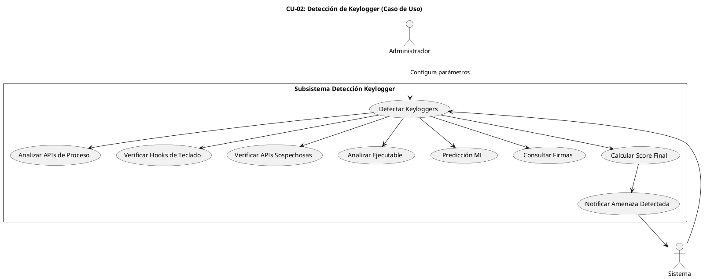

---

## 🔒 CU-03: Cuarentena de Archivos

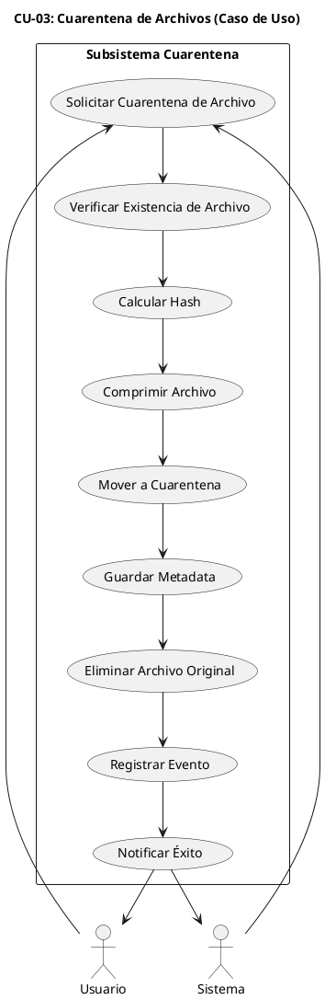

---

## 🛡️ CU-04: Gestión de Amenazas

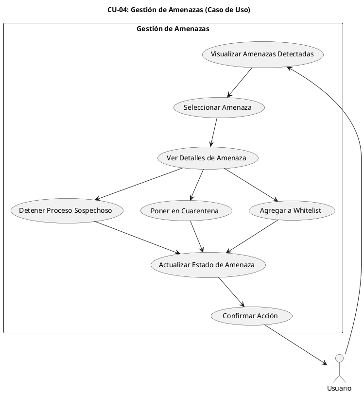

---

## ⚙️ CU-05: Configuración del Sistema

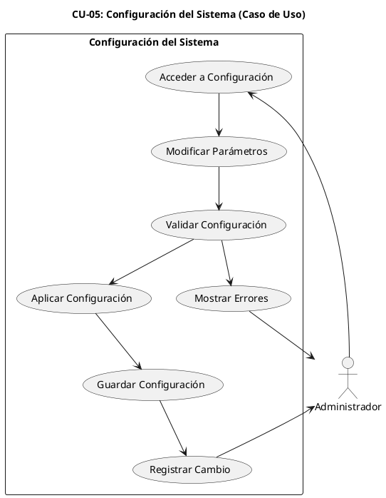

---

## 🧠 CU-06: Análisis de Comportamiento

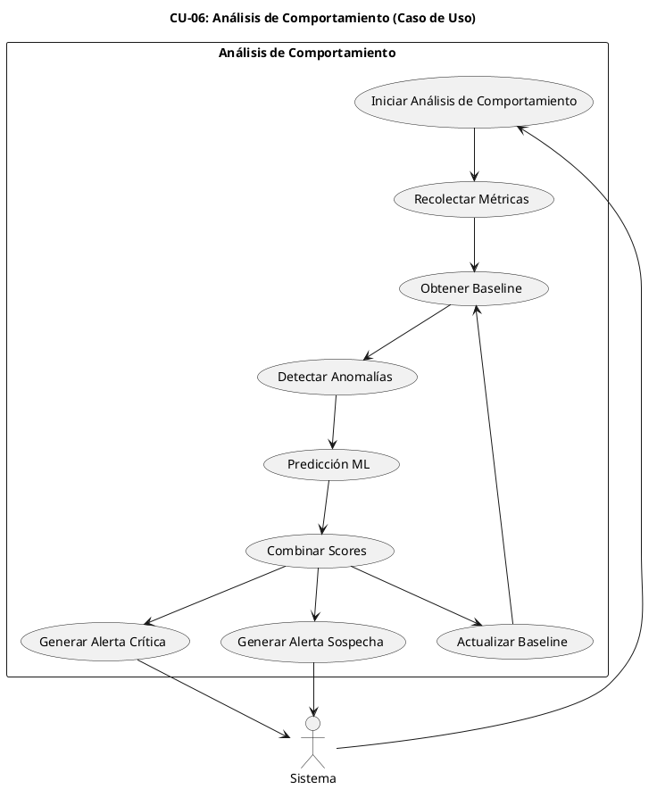

---

## 📊 CU-07: Generación de Reportes

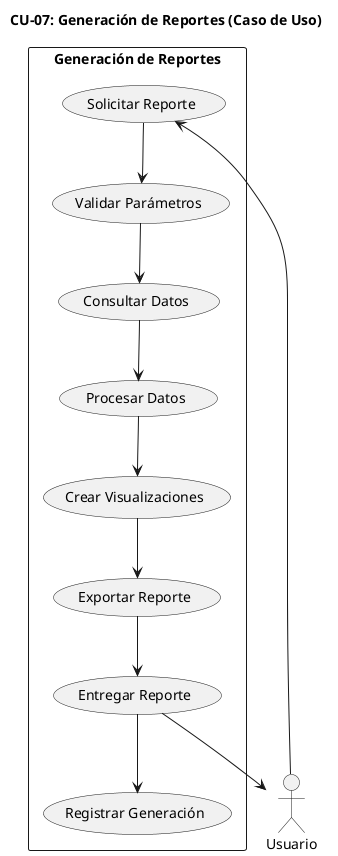

---

## 🔄 CU-08: Actualización de Firmas

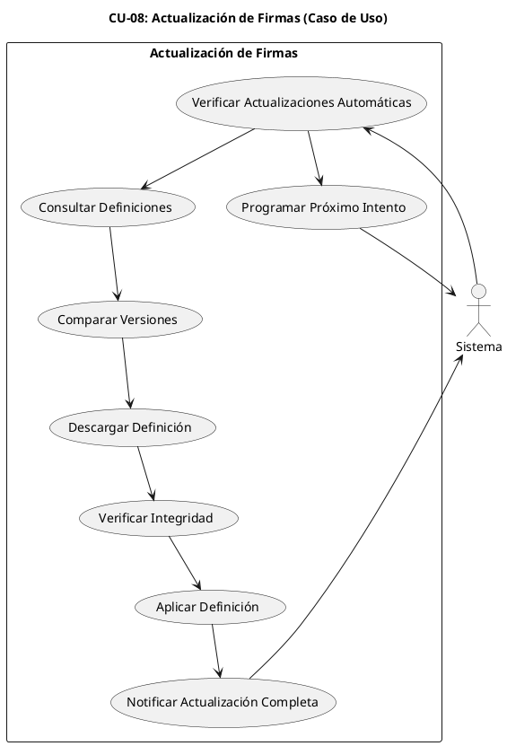

---

## 📄 CU-09: Whitelist/Blacklist

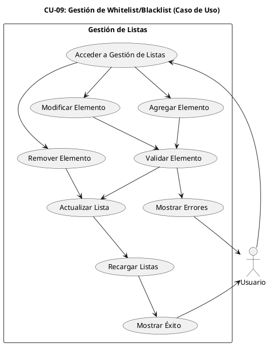

---

## 🚨 CU-10: Respuesta a Incidentes

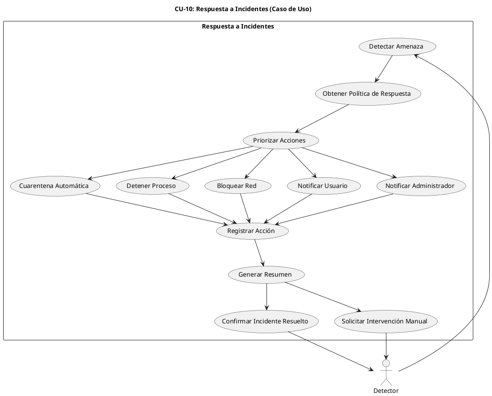

---

## 🔄 Diagrama de Interacciones entre Casos de Uso

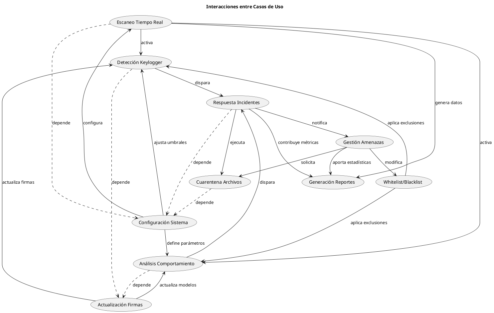

---

## 📈 Métricas y KPIs de Casos de Uso

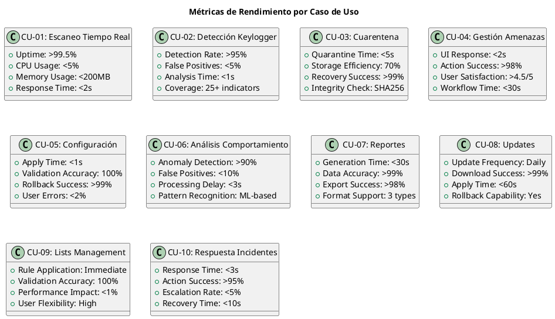