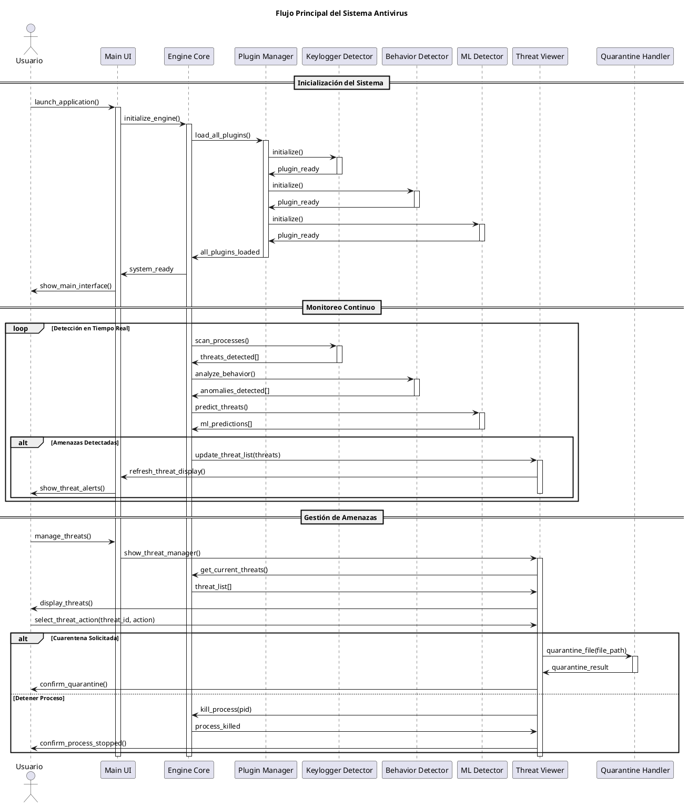
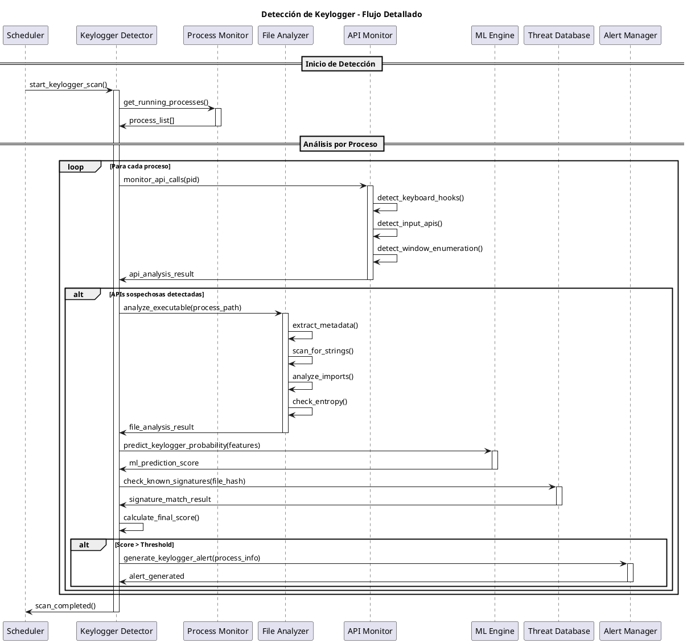
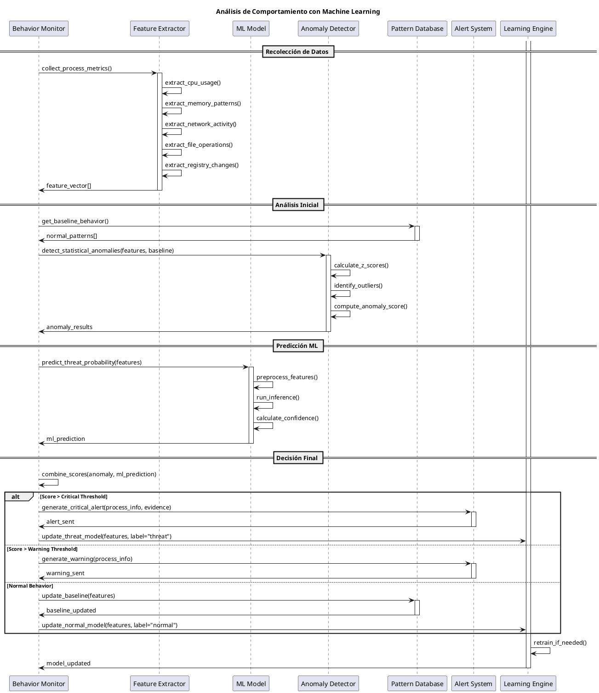
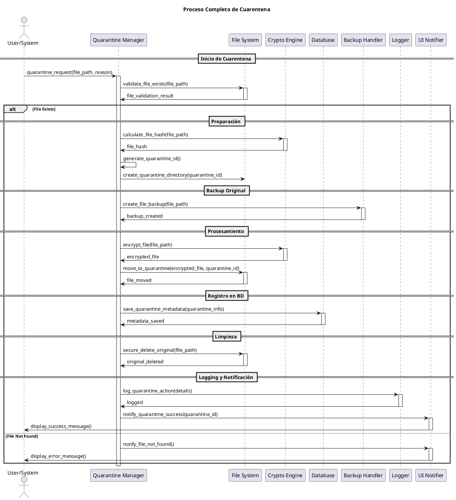
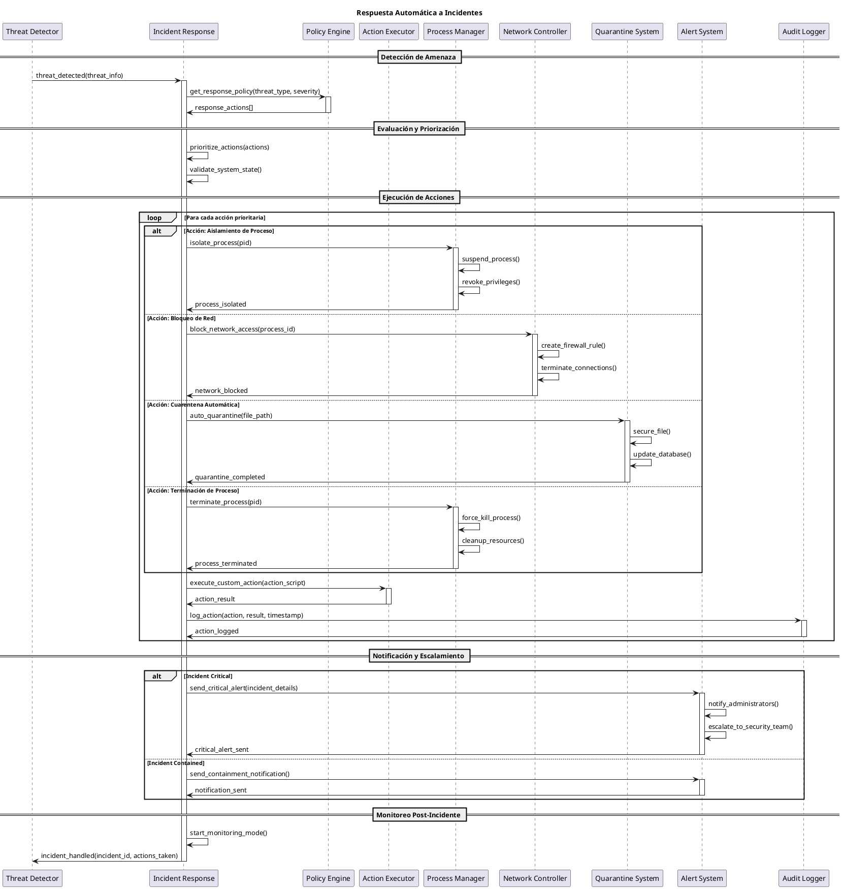
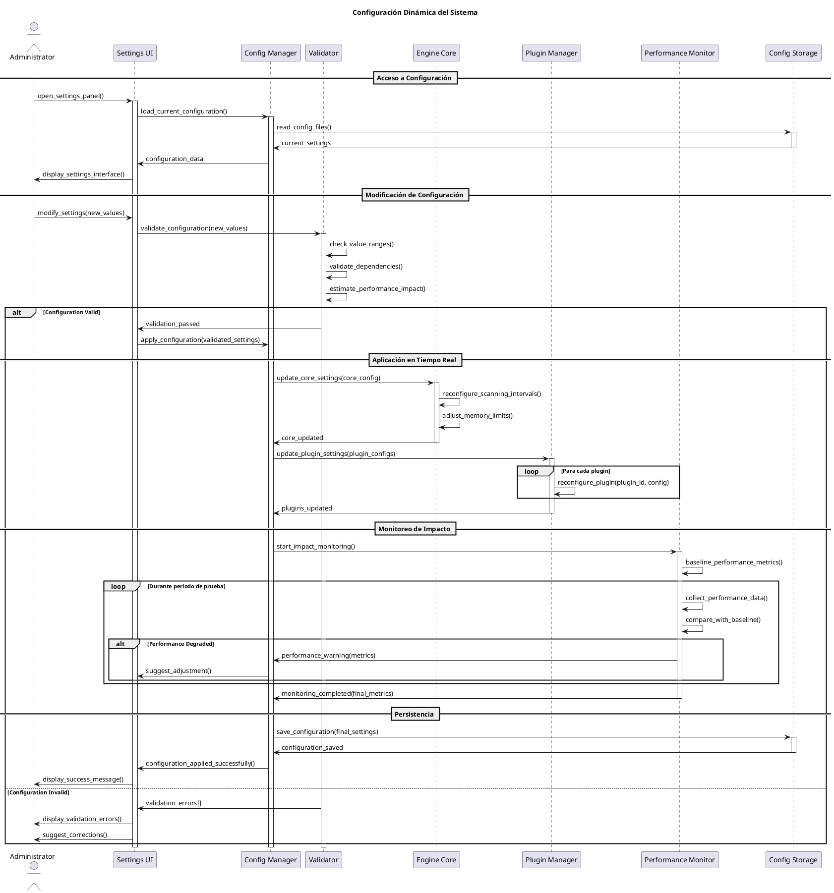
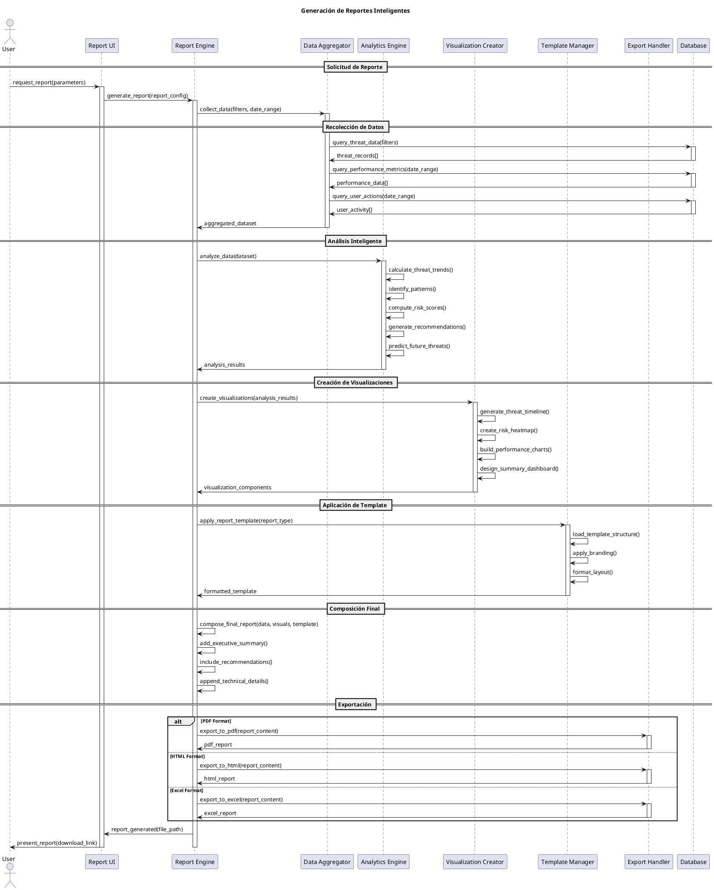
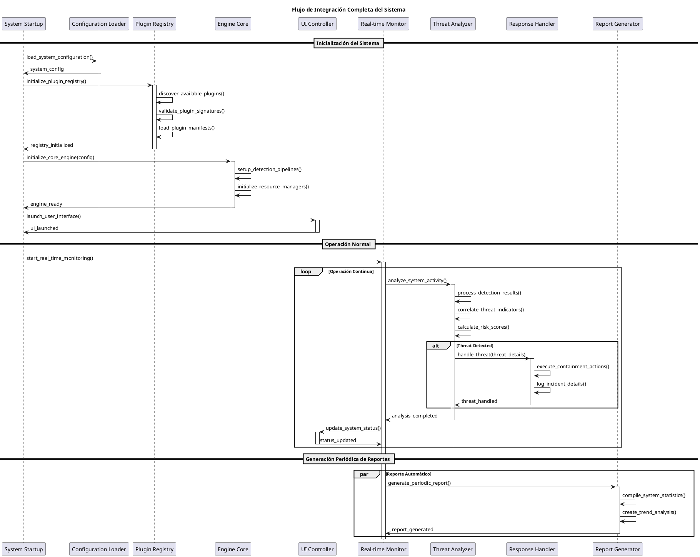

# Diagramas de Secuencia - Sistema Antivirus

## 🔄 Flujo Principal del Sistema

---

## 🔑 Detección de Keylogger - Flujo Detallado

---

## 🧠 Análisis de Comportamiento ML

---

## 🔒 Proceso de Cuarentena

---

## 🚨 Respuesta Automática a Incidentes

---

## 🔧 Configuración Dinámica del Sistema

---

## 📊 Generación de Reportes Inteligentes

---

## 🔄 Flujo de Integración Completa

